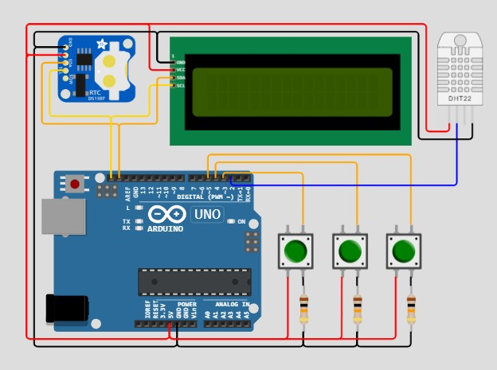

# Duino-clock
## About
  A simple Arduino digital clock with buttons for adjust time + temperature and humidity room monitoring
## Materials
   * Arduino.
   * RTC DS1307
   * DHT22 sensor. 
   * Lcd 16x2 I2C.
   * Wirings.
   * adaptor 12v.
## Wiring diagram
  
## Galery
  Coming soon...
## Demo Simulation
  https://wokwi.com/projects/385725932758968321
## Reference
  https://projecthub.arduino.cc/tittiamo68/clock-set-date-time-c0b575
